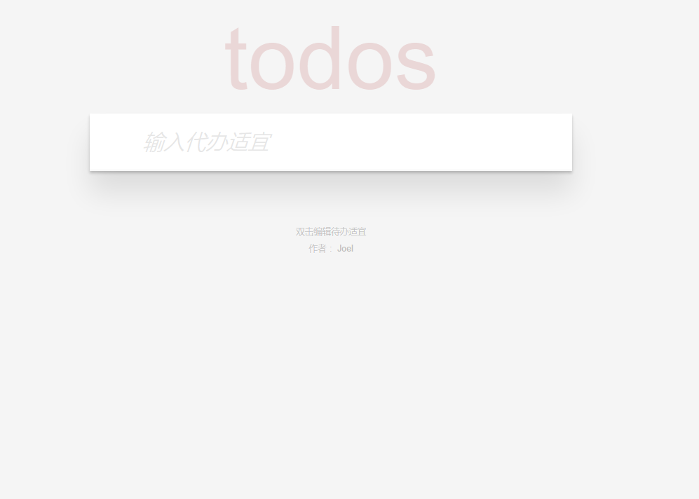
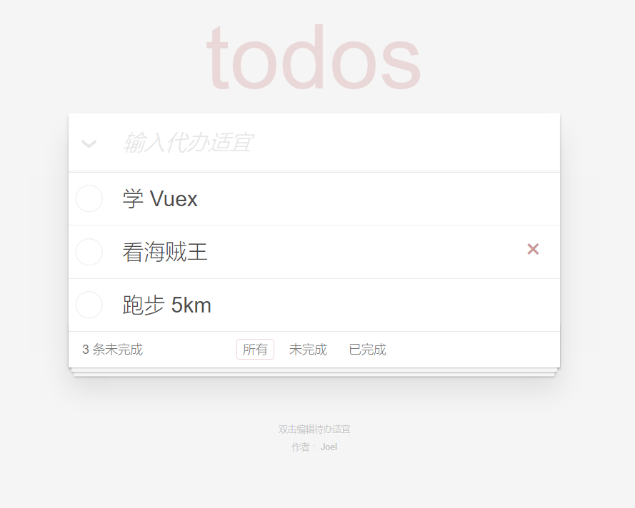
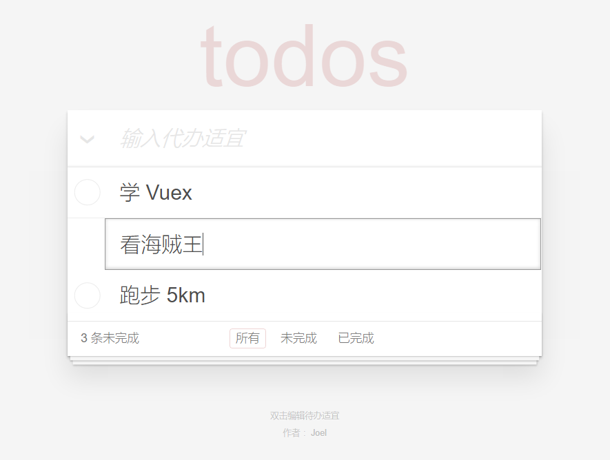
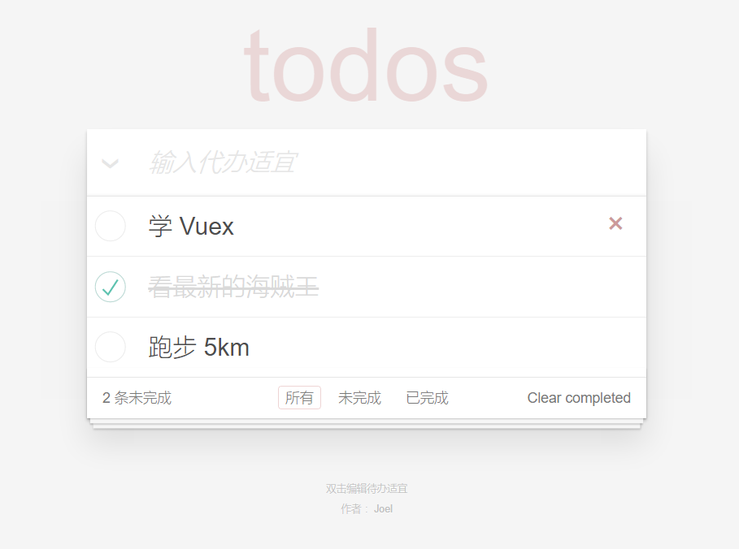
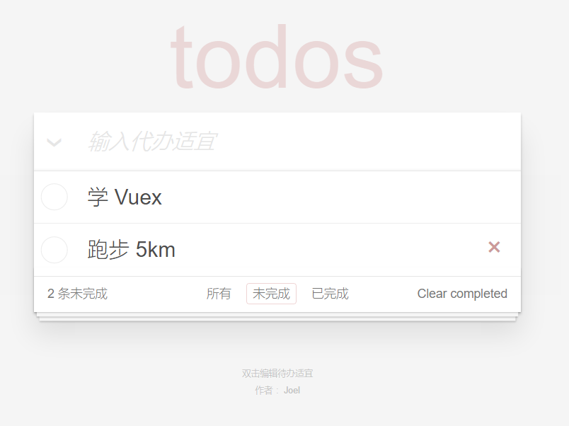
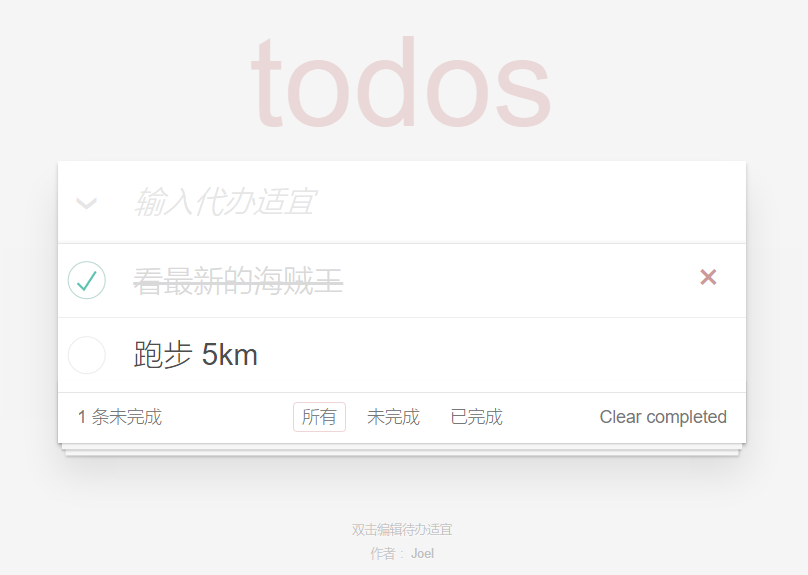

# 待办适宜
这是一个用[Vue.js](https://cn.vuejs.org/) 做的练手项目。在线演示，点[这里](https://iamjoel.github.io/todolist/)。

先来几张图片。  
默认的外观：  


添加几个待办适宜后的外观：  


编辑待办适宜后的外观：  


标记为已完成后的外观：  


筛选未完成的外观：  


删除1个待办适宜后的外观：  


实现思路：
用一个数组保存所有待办适宜。每个待办适宜的格式是如下
```
{
  id: xxxxx, // 唯一标识
  title: '', // 标题
  completed: false // 是否已完成
}
```

我用新建待办适宜时的时间戳做那条待办适宜的`id`。

对待办适宜的增删改查就是对数组的增删改查。下面是部分代码  
新增
```
create: function() {
  var title = this.newTodo.trim()
  if (title) {
    this.todos.push({
      id: Date.now(),// 用当前时间戳做为id
      title: title,
      completed: false
    })
  }
  this.newTodo = ''
}
```

修改
```
update: function(todo) {
  if (!this.editingTodo) {
    return
  }
  this.editingTodo = null
  todo.title = todo.title.trim()
  if (!todo.title) {
    this.remove(todo.id)
  }
}
```

删除
```
remove: function(id) {
  this.todos = this.todos.filter(function(todo) {
    return todo.id !== id
  })
}
```

查看所有已完成的
```
completed: function(todos) {
  return todos.filter(function(todo) {
    return todo.completed
  })
}
```

前端路由用的 [director](https://github.com/flatiron/director)。当然，用 [vue-router](https://router.vuejs.org/zh-cn/index.html) 也是可以的。

为了下次进来还能看到以前编辑的待办适宜。把数据存在了 localStorage。
```
watch: {
  todos: { // 数据一变化，就存一下
    deep: true,
    handler: todoStorage.save
  }
}
```

所有源码见[这里](https://github.com/iamjoel/todolist)。

